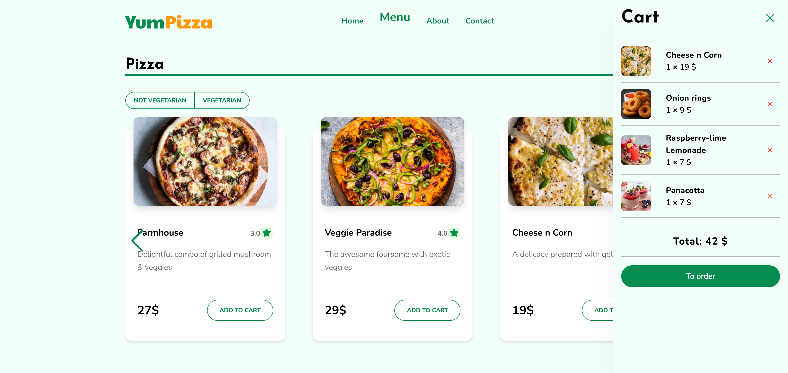
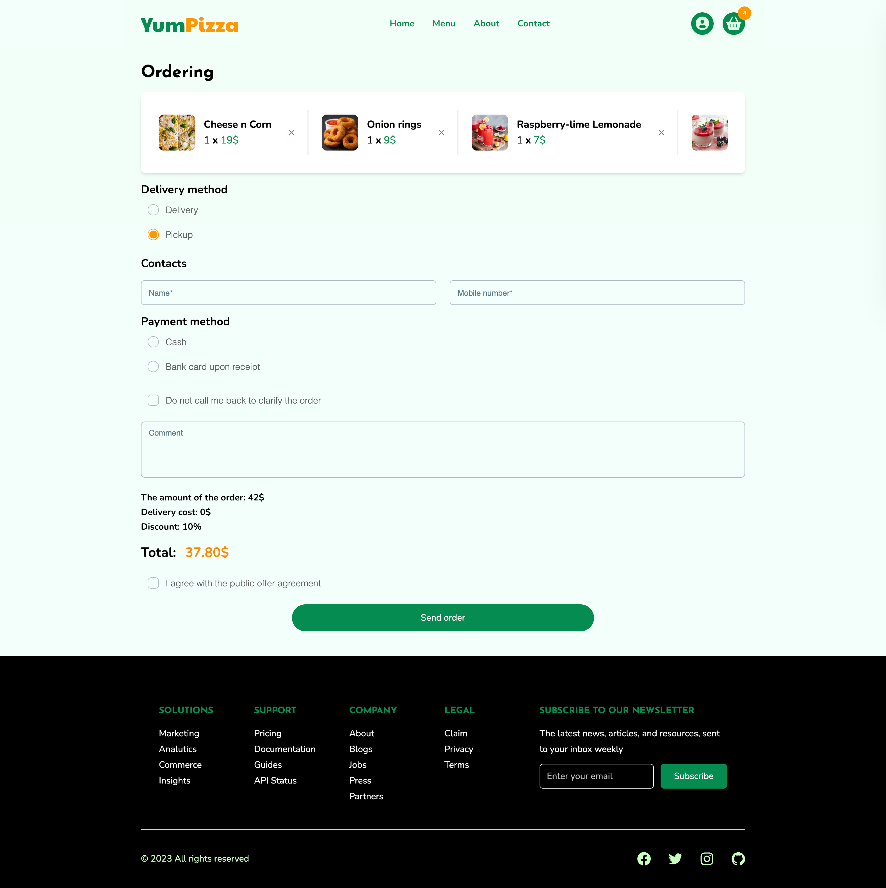

 
<h1 align='center'>YumPizza</h1>

<h2>About the project</h2>

This is a e-commerce website built with React(Typescript) and TailwindCSS. This is a team project written by 2 developers. This is the site of a restaurant specializing in pizzas, hence the name YumPizza.

The following tasks were completed in the project: writing a database, storing cookies, adding products to the cart, and a checkout form.

👉 Live Demo: <a href='https://store-template-dusky.vercel.app/'>YumPizza Demo</a>

<h3>Build with:</h3>

» Frontend

](https://skillicons.dev)

» Backend

](https://skillicons.dev)

<h2>Screenshots of the Project 📸</h2>
 
<h3 align='center'>Home Page 🏠</h3>

  
<h3 align='center'>Menu Page 🍕</h3>

 
 
<h3 align='center'>About Page 👋</h3>

 
 
<h3 align='center'>Cart 🛒</h3>

 
 
<h3 align='center'>Order Page 🛍️</h3>

